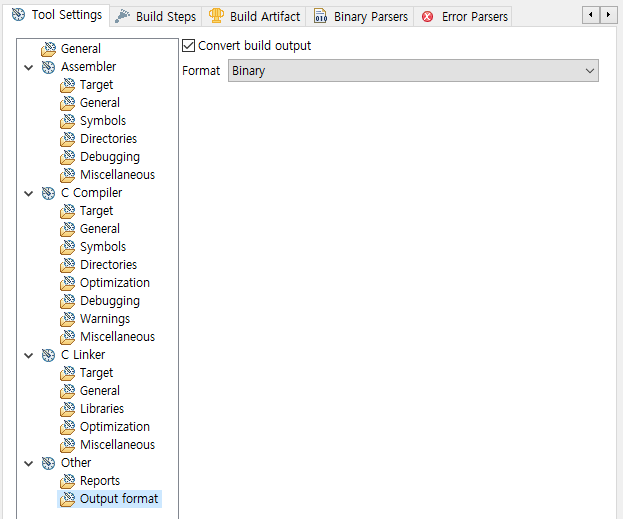
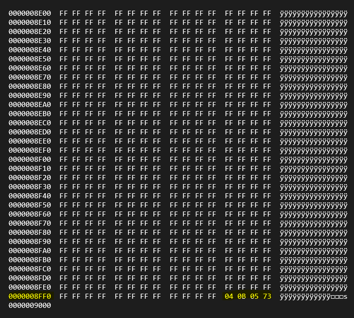
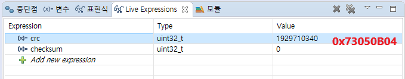

# STM32_HAL_CRC

I've implemented test code to check flash integrity with CRC checksum
It could be simple with IAR workbench as it supports CRC checksum.
But it could be tricky with Truestudio as it doesn't support CRC checksum.
I used SRecord(http://srecord.sourceforge.net/) to add CRC checksum to the binary file.

Tutorial: https://blog.naver.com/eziya76/221507312819 (Written in Korean)

[Checkpoint]
1) Build project and output format is binary
<br><br>
2) SRecord will calculate CRC from 0x8000000 to 0x8008FFB and place checksum at 0x8008FFC
```
c:\SREC\srec_cat.exe STM32F4_HAL_CRC.bin -binary 
-crop 0x0000 0x8FFC -fill 0xFF 0x0000 0x8FFC
-stm32-l-e 0x8FFC 
-o STM32F4_HAL_CRC_X.bin -binary
```
3) Checksum is added to the binary like below
<br><br>
4) Upload STM32_HAL_X.bin and run
5) HAL_CRC_Calculate API will calculate CRC from 0x8000000 to 0x8008FFB
```
crc = HAL_CRC_Calculate(&hcrc, (uint32_t*)ROM_START, (uint32_t)ROM_LEN_WORD);
checksum = *(uint32_t*)CHECKSUM;
```
<br><br>
6) If the calculated value is matched with written checksum at 0x8008FFC, LED blinks fast, if not LED blinks slowly.
```
HAL_GPIO_TogglePin(GPIOD, GPIO_PIN_15);
if(crc == checksum)
{
	HAL_Delay(100);
}
else
{
	HAL_Delay(1000);
}
```
